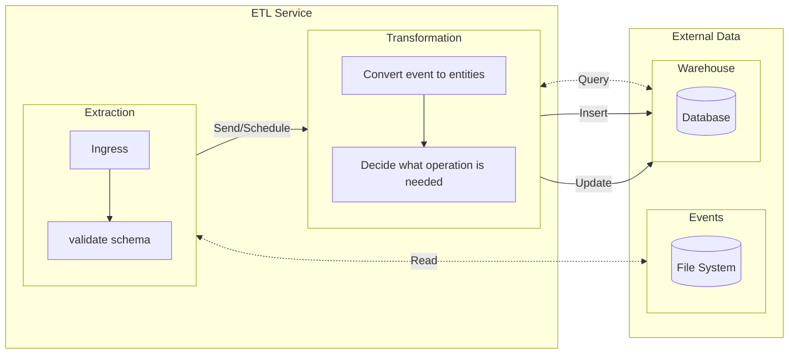
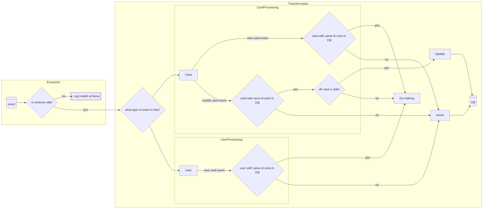

> It contains a mix of detective work, ops-like work, programming and big-picture perspective

# 2022-06-07
## First look
### Readme.md
Getting a quick look around after work, I don't have much energy left so ill make it quick.

Going through the readme:
>  It contains a mix of detective work, ops-like work, programming and big-picture perspective
Interesting


ETL pipeline to store data (what about consumption?)
In -> Transform -> Out
Event -> Service -> PostgreSQL
(Versatility of events? Will fe add more in the future?)

Will need to create schema and fix/finish the prototype. Will it be worth starting over?
What is the problem the prototype is supposed to fix?


### rerun.sh & clean.sh
Should work as is

### docker-compose.yml

etl entrypoint could use env variable but it's good enough for a prototype

python services uses a prebuilt image name, will it even work?
```yml
image: data-eng-challenge/cards:latest
```
Maybe I'm missing something? Let's try it first

Yep those are available on docker.io :+1:

### Running the project
`./rerun.sh` yields an error
```log
 => ERROR [data-eng-challenge/users:latest 4/5] RUN pip install -r requirements.txt                                                    0.1s
 => CACHED [data-eng-challenge/etl:latest 3/6] COPY ./src/requirements.txt /app/requirements.txt                                       0.0s
 => ERROR [data-eng-challenge/etl:latest 4/6] RUN pip install -r requirements.txt                                                      0.1s
------
 > [data-eng-challenge/users:latest 4/5] RUN pip install -r requirements.txt:
------
------
 > [data-eng-challenge/etl:latest 4/6] RUN pip install -r requirements.txt:
------
failed to solve: executor failed running [/bin/sh -c pip install -r requirements.txt]: failed to create endpoint bcvv6u2ejq1fj04d197zkj7iq on network bridge: failed to add the host (vethef13ffd) <=> sandbox (veth7cd880c) pair interfaces: operation not supported
```
Ok I need to reboot, it's a kernel update messing up with docker network

Yet that's it, it runs now.

## Looking at the code
### users
Generate & flush random events in a loop
Files are dump in `data/events/inbox/users/`
Its simple json, always the same structure

### cards
cards can generate 3 different json structure
* new card
* modify card
* missing key (new card with a missing user_id field)

### etl
Wow, it's just an `Hello World`
Even `requirements.txt` is empty

## Recap before signing off
Ok back to the readme, it's unclear to me what should be done. What is the expected transformation?
Is it simply to move it from files to db?

:eyes:

> meant to ferry data from some services over into a Data Warehouse
> [...]
> Implement a Python-based ETL service such that events are successfully propagated from the services that
> produce events, and into the PostgreSQL database

Ok the transformation is from a json string to a table row in postgres.
This should be easy to do a "naive implementation"

I'll have to keep in mind that i'm dealing with:
* Partial/incomplete data (missing card user_id)
* Files (requiring IO operation)
    * Look into how python does async io
* Potentially large amount of data
* Un-ordered data
    * Will make card modification tricky to handle
* Can a file be overwritten while I work on it?
    * No it uses a new uuid for each file
* What do I do with events once they are stored? Move or delete?
* Don't fall into optimizing for parallel work, just keep the door open.

Even though I barely ever work with python i'm confident I can do it!


# 2022-06-10
## Getting started
Booting up my IDE, installing python plugin & looking a bit more at `etl/`
What does `wait-for-it.sh` do?
> # Use this script to test if a given TCP host/port are available
Weird, it's in a docker container, why would you need to check for available ports?

ah! It's for the database (not etl), nice!

I want to use pipenv, but I remember the readme mentioning something else, ill circle back to it once I need to install a dependency

First thing should be to do a naive approach to get to know python.
Load a file, convert json to something python can use and push it to the database
Assume best case scenario, don't think about re-parsing files or correcting incomplete json.

## Loading files
I'm going for the easiest/most straight forward way possible first
[x] Json file to Dict (json.load & open to parse)
[x] Load all events (os.scandir to use iterator and work with unknown directory size)

### What happened along the way
Here's what I did while I implemented the basic implementation
* Added helpers along the way to extract what clearly doesn't belong in the control flow
* Added an event variable to control the location of the inbox folder. It was necessary to run locally (easier for debugging) while keeping a separate config for docker
* Added volumes to `etl` service to access event files

## Database
Now that I have some data, I can try to setup a database connection and send data to it.
It's important to do the database connection before parsing the data further because it will be affected by the way the connection ingest data.
`psycopg2` seems like a valid choice, it's low level enough to be flexible but high level enough to save me time (it also accepts dict witch will save me time initially and ill be able to add things on top if needed)

Now is the time to look into the requirements for managing dependencies :eyes:

oh great, `pyenv` is to manage python versions, not dependencies :muscle::tada:
I can't find anything against using `pipenv` so ill use that


Fighting with python env once again T-T
* My distro's python is 3.10, project require 3.7.1
* Installed `pipenv` using my distro's package manager (it also installs `pip` & `pyenv`)
* I'm getting errors when I try to create a virtualenv, it complains about `--external`
* I manage to create a virtual environment with python 3.7.1
* My ide refuse to recognise (or install) python dependencies
* Debugging with my IDE yield `Process finished with exit code 139 (interrupted by signal 11: SIGSEGV)` but running the script with without debugger works fine...
* Pipenv complains about `backports.zoneinfo` (is there a version mismatch somewhere?)

Back to basic, something tells me the version missmatch between the virtual environment & my os is causing issues
* Installing `pyenv` for real
* Follow the readme to setup a virtual environment
* rc/path issues, should be good now
* Install pipenv using pip from a pyenv shell using python 3.7.1
* Couldn't install `backports.zoneinfo` again ><

```terminal
 /usr/lib/python3.10/subprocess.py:1070: ResourceWarning: subprocess 56002 is still running
  _warn("subprocess %s is still running" % self.pid,
ResourceWarning: Enable tracemalloc to get the object allocation traceback
sys:1: ResourceWarning: unclosed file <_io.FileIO name=5 mode='rb' closefd=True>
ResourceWarning: Enable tracemalloc to get the object allocation traceback
sys:1: ResourceWarning: unclosed file <_io.FileIO name=8 mode='rb' closefd=True>
ResourceWarning: Enable tracemalloc to get the object allocation traceback
/usr/lib/python3.10/subprocess.py:1070: ResourceWarning: subprocess 56005 is still running
_warn("subprocess %s is still running" % self.pid,
ResourceWarning: Enable tracemalloc to get the object allocation traceback
sys:1: ResourceWarning: unclosed file <_io.FileIO name=7 mode='rb' closefd=True>
ResourceWarning: Enable tracemalloc to get the object allocation traceback
sys:1: ResourceWarning: unclosed file <_io.FileIO name=10 mode='rb' closefd=True>
ResourceWarning: Enable tracemalloc to get the object allocation traceback
```
Python 3.10 seems to be open somewhere :thinking:
`killall python` does kill some python process, but the error persist, ill do a quick reboot JIC
Same issue, weirdly it doesn't cause the issues at the root of the repo, only in `etl/`. Maybe its due to `psycobg`?
Even installing `psycopg` in a new folder/pipenv project doesn't work 
```terminal
data-engineer-challenge on  master [✘!?] via 🐍 v3.7.1 (data-engineer-challenge) 
❯ pipenv install psycopg -v              
Courtesy Notice: Pipenv found itself running within a virtual environment, so it will automatically use that environment, instead of creating its own for any project. You can set PIPENV_IGNORE_VIRTUALENVS=1 to force pipenv to ignore that environment and create its own instead. You can set PIPENV_VERBOSITY=-1 to suppress this warning.
Installing psycopg...
Installing package: psycopg
Writing supplied requirement line to temporary file: 'psycopg'
Installing 'psycopg'
$ /home/damon/.pyenv/versions/3.7.1/envs/data-engineer-challenge/bin/python -m pip install --verbose --upgrade --exists-action=i -r /tmp/pipenv-v7zmyw_u-requirements/pipenv-g1gxaqjf-requirement.txt -i https://pypi.org/simple
Using source directory: '/home/damon/.pyenv/versions/3.7.1/envs/data-engineer-challenge/src'
Error:  An error occurred while installing psycopg!
Error text: 


✘ Installation Failed 
(data-engineer-challenge) 
```
Using pip didn't work earlier but seems to work now?
ok, removing Pipfile, Pipfile.lock and remade the pipenv files while in the pyenv shell (so the both use the same env) seems to work, I was able to install `psycopg`
More segfault >>

ok, `psycopg` requires a wrapper
```
ImportError: no pq wrapper available.
Attempts made:
- couldn't import psycopg 'c' implementation: No module named 'psycopg_c'
- couldn't import psycopg 'binary' implementation: No module named 'psycopg_binary'
- couldn't import psycopg 'python' implementation: libpq library not found
```
It wasn't specified in the doc >>
> Unless you compile psycopg2 as a static library, or you install it from a self-contained wheel package, it will need the libpq library at runtime (usually distributed in a libpq.so or libpq.dll file). psycopg2 relies on the host OS to find the library if the library is installed in a standard location there is usually no problem; if the library is in a non-standard location you will have to tell Psycopg how to find it, which is OS-dependent (for instance setting a suitable LD_LIBRARY_PATH on Linux).

Ok it was, but to be fair it was buried under the 2.7 & 2.8 section while I use 3.0
A quick `yay -S postgresql-libs` and I'm in business :muscle:

I need to better configure my connection :eyes:
Doc for psycopg is confusing, but I managed to figured it out
It also added the ports docker-compose config to the wrong container :S

Finally, I managed to get the debugger running. somehow it I run it with verbose (-v) it works :shrug:

Added a table setup method and an insert user method. Ill will ensure we can save more than one event type later.

It works good enough for now. I can clean it up and improve it later.

Before I log off, I want to try to fix the docker-compose etl service. Its not installing anymore, its complaining about `zoneinfo`...
It's a version missmatch once again! Updating the base image to python:3.7.1 did the trick.

## Recap before signing off
I tried to stay as pythonistic & simple as possible, just to get the python API on my good side.
Next time I will make place for a proper data pipeline

### Time split
* 3/6 of my time on fighting against the setup (python, pip and virtualenv)
* 2/6 was spent on the database, trying to follow the wrong doc for a little while 
* 1/6 was spent in loading files from the filesystem and converting them to dict

### Tomorrow
My plan is to split the main.py file into isolated chunks.
I might change my mind after a good night sleep, but I think these will be a good starting point:
* Init (config, db, call main logic flow)
* Extract (load event files)
* Transform (??? we will see, I ~~might~~ will split this one further)
* Load (data to query)

Things I will have to figure out later: 
* Who will commit the transaction? (load or a higher layer?)
* What is the python way to do polymorphism? I was shunned in the past because I used lambda in python so ill do a bit of research before I implement anything

Tomorrow make sure you save your graphs! (mermaid or svg?)

# 2022-06-19
I'm finally able to work on this again.
Plans for today is to:
* Graph the outline of the architecture I'm aiming for
* Implement a working prototype following that architecture

The core API should be already taken care of (fs io, interact with db, etc)
It will require research on Python design patterns but don't get into a rabbit hole.

Research doc:
[python-patterns.guide](https://python-patterns.guide/) is a good resource but a bit too verbose.

## Architecture
Here we have 3 main bottlenecks.
* FS read&write
* Database interaction
* Blocking IO

The more data we have, the more thore bottlenecks will become cluttered and show down the ETL.
ATM it's not an issue but good architecture is about planning for the future and without more information on the project it's all I can foresee.


* Extraction & Transformation can be split in multiple service & scaled later.
* Data warehouse can use sharding to enable more read & write if needed.


### Extraction layer
TLDR: The extraction part of the service should be its own layer.

In its current form, because the extraction layer uses the FS, it's blocked by IO operations & can't vertically scale easily.
By moving the extraction to its own layer, it will be possible (without too much cost) to add new ways to ingest data, scale vertically & manage locks/scheduling.

### Transformation layer
Transformation in this case is mostly about updating the right data in the right way.
**Note that I'm assuming we want to store the user & card data, not the event itself as it would be too easy to test a senior/staff. If this was a "real" task I would ask for more detail on the requirements & expected outcome**
This process depends on the type of data we have, lets look at the events and determine what will be the final schema and what type of transformation/logic we need.

* New card
  * Insert into db 
  * Can have missing user_id which makes it unusable in my book. Usually I would ask for more info on the expected outcome, but I will log an error for now
* Modify card
  * Find & update the card data (based on id given the value remains the same)
* New user
  * Insert into db 

Since we won't ingest data in the same order that they are generated it is possible we will try to update cards that aren't yet in the db, luckily all the relevant data to create the card is already in the update event 

Flowchart of the transformation logic


I think I got enough data to get started

## Implementation
Splitting main.py into different layers is going as I intended to.
I'm intentionally making the simplest of validation as this test is about architecture and not my knowledge of the Python library ecosystem
Added a storage.py file and tried to migrate the db code from main.py to it.
It worked for a few minutes, but after taking a break with a friend it doesn't work anymore... I don't even have an error printed or a breakpoint on error.
Digging deeper it seems to break at /home/damon/.pyenv/versions/3.7.1/lib/python3.7/site-packages/psycopg/pq/pq_ctypes.py:84
```python
self._notice_receiver = impl.PQnoticeReceiver(  # type: ignore
    partial(notice_receiver, wconn=ref(self)) # <--- breaks here
)
```

I'm dead in the water. It's past 10pm and I can't debug... I'll revisit another day and see if I can get the debugger working again (it was already flaky)
